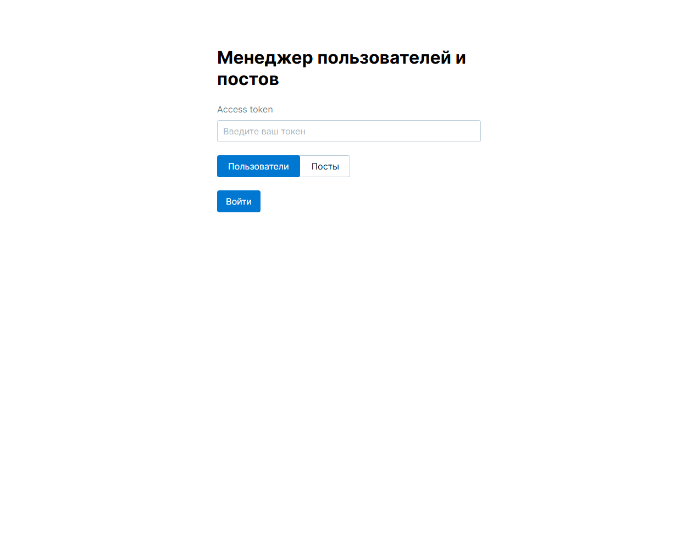
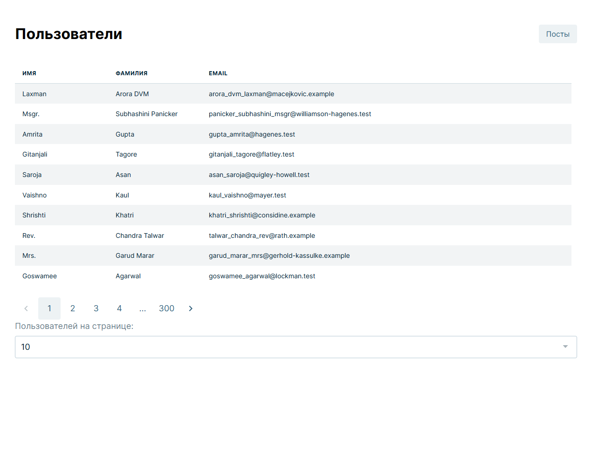
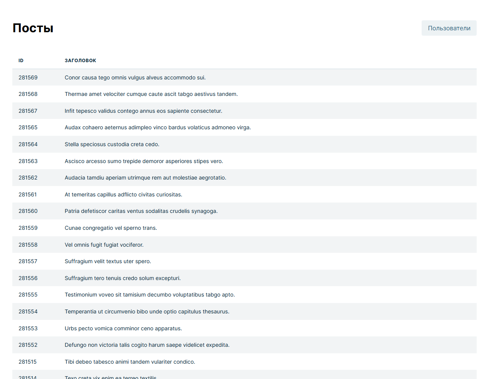
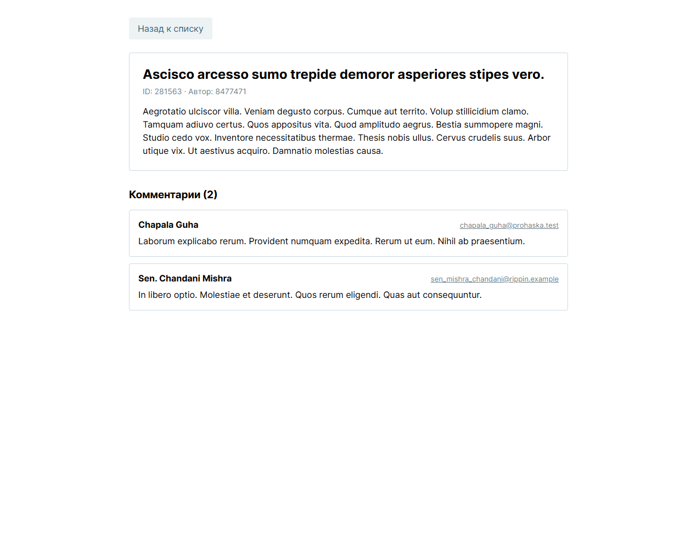

# GoRest Explorer

SPA-приложение для работы с публичным API [gorest.co.in](https://gorest.co.in/). Авторизация по access token, просмотр списков пользователей и постов с пагинацией, карточки сущностей с детальной информацией и комментариями.

Тестовое задание для стажировки ДИП:КОД.

## Стек

- **React** + **TypeScript**
- **Redux Toolkit** + **react-redux** - управление состоянием
- **React Router v6** - навигация между страницами
- **Consta UI Kit** - библиотека UI-компонентов
- **Vite** - сборщик и dev-сервер
- **CSS Modules** - изолированные стили компонентов

## Возможности

- Авторизация по access token с сохранением в `localStorage` (не сбрасывается при перезагрузке)
- Защита приватных маршрутов через `ProtectedRoute`
- Просмотр списка пользователей с пагинацией (10 / 25 / 50 элементов на страницу)
- Просмотр списка постов с пагинацией
- Переключение между разделами "Пользователи" и "Посты" из шапки таблиц
- Карточка пользователя с детальной информацией (имя, email, пол, статус, ID)
- Карточка поста с автором, телом поста и всеми комментариями (загружаются параллельно через `Promise.all`)
- Адаптивная вёрстка для разрешений от 1024px до 1920px

## Скриншоты

### Главная страница

Форма ввода access token и выбор раздела для перехода.



### Список пользователей

Таблица с тремя колонками, пагинация и селект для выбора количества элементов на странице.



### Список постов

Таблица постов с идентификатором и заголовком.



### Карточка поста с комментариями

Детальная информация о посте и список всех комментариев к нему.



## Установка и запуск

Требуется Node.js версии 18 или выше.

```bash
# клонировать репозиторий
git clone https://github.com/tokarevvd06-dev/Task-for-DeepCode.git
cd Task-for-DeepCode

# установить зависимости
npm install

# запустить dev-сервер
npm run dev
```

После запуска приложение откроется на `http://localhost:5173`.

## Где получить access token

1. Перейти на [gorest.co.in/my-account/access-tokens](https://gorest.co.in/my-account/access-tokens)
2. Авторизоваться через GitHub или Google
3. Сгенерировать access token
4. Вставить токен в форму на главной странице приложения

## Доступные скрипты

| Команда           | Действие                                     |
| ----------------- | -------------------------------------------- |
| `npm run dev`     | Запуск dev-сервера                           |
| `npm run build`   | Production-сборка в папку `dist/`            |
| `npm run preview` | Локальный предпросмотр собранного приложения |

## Архитектура

```
src/
├── api/              # слой работы с gorest API
│   └── gorest.ts     # обёртки request / requestPaginated и публичные функции
├── components/       # переиспользуемые презентационные компоненты
│   ├── PostCard/
│   ├── PostTable/
│   ├── ProtectedRoute.tsx
│   ├── TokenInput/
│   ├── UserCard/
│   └── UserTable/
├── pages/            # умные страницы-контейнеры
│   ├── MainPage/
│   ├── PostCardPage/
│   ├── PostsPage/
│   ├── UserCardPage/
│   └── UsersPage/
├── store/            # Redux store и slices
│   ├── authSlice.ts
│   ├── hooks.ts      # типизированные useAppDispatch / useAppSelector
│   ├── index.ts
│   ├── postsSlice.ts
│   └── usersSlice.ts
├── types/            # TypeScript-интерфейсы для сущностей API
│   └── api.ts
├── App.tsx           # роутер
└── main.tsx          # точка входа, провайдеры (Redux, Router, Theme)
```

### Ключевые архитектурные решения

**Разделение умных страниц и тупых компонентов.** Страницы (`*Page`) работают с Redux и роутингом, презентационные компоненты получают данные исключительно через пропсы. Это упрощает тестирование и переиспользование.

**Изолированный API-слой.** Файл `api/gorest.ts` не знает про Redux - принимает токен аргументом и возвращает Promise. Обёртки `request` и `requestPaginated` инкапсулируют работу с fetch, заголовки авторизации, парсинг заголовков пагинации и обработку ошибок.

**Параллельная загрузка связанных данных.** В карточке поста сам пост и его комментарии загружаются одновременно через `Promise.all`, что сокращает время ожидания вдвое по сравнению с последовательными запросами.

**Типизированные хуки Redux.** В `store/hooks.ts` определены `useAppDispatch` и `useAppSelector`, которые автоматически выводят типы из структуры store, избавляя от необходимости вручную аннотировать селекторы в каждом компоненте.

**CSS Modules для изоляции стилей.** Каждый компонент и страница имеют собственный `.module.css` файл рядом с `.tsx`. Это исключает конфликты классов между компонентами и упрощает поиск стилей.

## API

Используются следующие эндпоинты gorest API:

| Метод | Эндпоинт                        | Назначение           |
| ----- | ------------------------------- | -------------------- |
| GET   | `/public/v2/users`              | Список пользователей |
| GET   | `/public/v2/users/:id`          | Один пользователь    |
| GET   | `/public/v2/posts`              | Список постов        |
| GET   | `/public/v2/posts/:id`          | Один пост            |
| GET   | `/public/v2/posts/:id/comments` | Комментарии к посту  |

Авторизация - через заголовок `Authorization: Bearer <token>`. Количество страниц для пагинации читается из заголовка ответа `x-pagination-pages`.

## Автор

[tokarevvd06-dev](https://github.com/tokarevvd06-dev)
